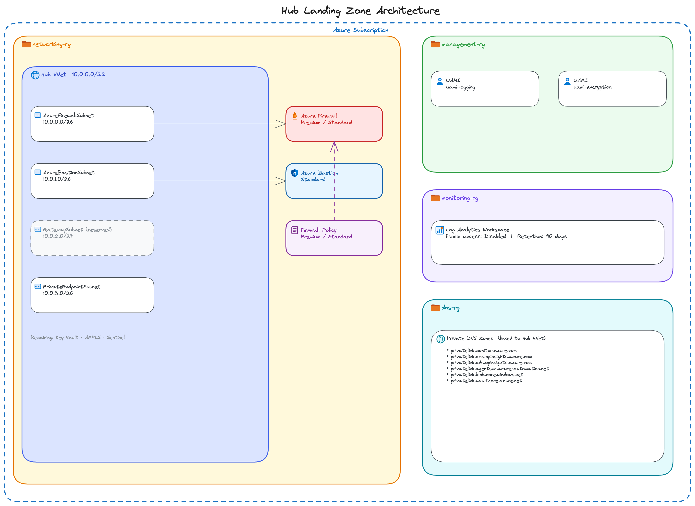

# azure-infrastructure

Modular Bicep templates for deploying a zero-trust Azure landing zone, built on [Azure Verified Modules (AVM)](https://azure.github.io/Azure-Verified-Modules/) — Microsoft's official, tested, and maintained module library. AVM removes the need to author raw resource definitions, so every deployment follows Microsoft's Well-Architected Framework recommendations out of the box.

## What's inside



| Folder | Description |
|---|---|
| `az-landing-zone` | Hub-spoke landing zone — resource groups, identities, networking, security, logging, and governance |
| `az-avd` | Azure Virtual Desktop spoke deployment |
| `az-image-builder` | STIG-hardened AVD image pipeline using Azure Image Builder |

## Architecture approach

- **Azure Verified Modules** — thin org wrappers call AVM modules; no raw resource declarations
- **WAF-aligned by default** — private endpoints, locks, RBAC, and diagnostic settings wired in from day one
- **Single deployment** — one `az deployment sub create` per environment, waterfall ordering via `dependsOn`
- **Environment-aware** — Firewall SKU, retention, and access tiers driven by the `environment` variable in each param file

## Hub landing zone components

```
Resource Groups (4)         networking · management · monitoring · dns
Managed Identities          uami-logging · uami-encryption
Key Vault                   CMK-ready, private endpoint, purge protection
Log Analytics + Sentinel    WAF-aligned, AMPLS, 90-day retention
Hub VNet                    Firewall · Bastion · Gateway · Private Endpoint subnets
Azure Firewall              Premium (prod) / Standard (dev/staging) + policy
Azure Bastion               Standard SKU
Private DNS Zones           Azure Monitor · Key Vault · Blob · and more
Private Endpoints           All data-plane traffic stays off the public internet
```

## Deploying the hub

```bash
az deployment sub create \
  --location eastus \
  --template-file az-landing-zone/main.bicep \
  --parameters az-landing-zone/params/hub.bicepparam
```
